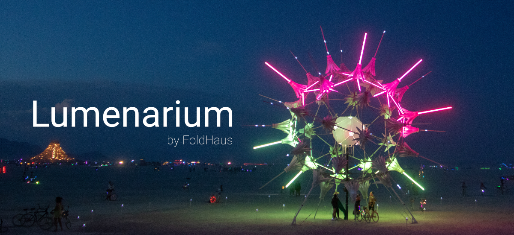

# Lumenarium by Foldhaus

## What Is Lumenarium?
Lumenarium is our custom build light and motion control software. It allows us to design light and motion patterns for our sculptures, visualize the output long before the sculpture is built, and iterate in real time to achieve the best visual results quickly.

[Foldhaus can be found here.](https://www.foldhaus.com)

## Features

The following features are under active development for integration in Lumenarium
* [Sculpture File Format](#sculpture-file-format)
* [DMX Output](#dmx-output)
* [Live Visualization](#live-visualization)
* [Animation Timeline](#animation-timeline)
* [Node Based Pattern Creation](#node-based-pattern-creation)
* [Live Compilation Reload](#live-compilation-reload)

***
### Sculpture File Format
Sculptures are specified via a structured text file so that it is easy to represent new sculptures, simply as strips of LEDs. 

Documentation coming soon.

***
### DMX Output
Lumenarium supports SACN output, and ArtNet is in development, via a DMX system which underlies them both.

***
### Live Visualization
We don't always have access to our physical sculptures while working on the lights and motion for them. Having a visualization of the sculpture lets us see what the patterns we develop will look like when running on the actual sculpture. 

The visualization runs in real time, and mirrors the DMX output the sculptures will receive, so any changes made in the software are immediately reflected, both in the visualization and in the data sent over the network.

***
### Animation Timeline
One goal of Lumenarium is to enable fine-grained control over procedural light and motion patterns. Patterns can be arranged on a timeline for manual sequencing. 

Coming Soon
* Pattern Fading/Cross fading
* Pattern parameter controls

***
### Node Based Pattern Creation
Pattern creation also happens within Lumenarium. Rather than program individual patterns in code, Lumenarium provides a node based interface to combine small units of functionality to create patterns. These patterns are available for sequencing in the animation timeline.

Coming Soon
* compilation of node based patterns
* more nodes!

***
### Live Compilation Reload
One of the most fulfilling parts of working on these sculptures is getting to iterate live on the lights and motion in front of the physical sculpture while on active display. While Lumenarium is designed to enable everyone to shape the visual identity of our sculptures, it also allows for low-level, fine grained control over the visual output as well. The software is split into a platform layer (currently Windows only, though there are plans to support Mac, and possibly Raspberry Pi), and an application library. The application library can be recompiled and hot loaded while the software is running to facilitate the fastest possible iteration time. 

To see how this works in detail see [Handmade Hero](https://guide.handmadehero.org/code/day022/)
